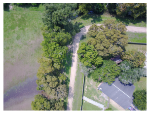
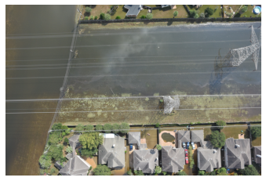
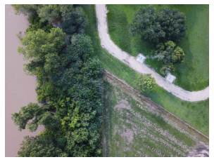
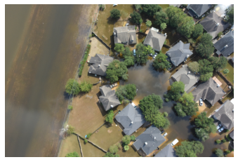
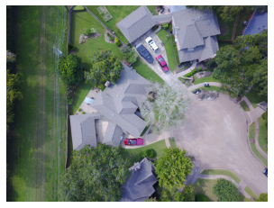

# DeepChoice-VQA

This repository contains the work done as part of laboratory project under Dr. Prateek Narang, Bits Pilani. 

## Project Overview
Visual Question Answering (VQA) on the FloodNet dataset with multiple architectures. 

- **Task**
  - Visual question answering on the **FloodNet Challenge @ EARTHVISION 2021 – Track 2** dataset.
  - Given a flood-scene image and a natural-language question, the model predicts a categorical answer (e.g., *flooded*, *non flooded*, counting answers, yes/no).

- **Key Result**
  - Implemented and evaluated multiple architectures for the VQA task, including **VGG–LSTM**, **parallel co-attention** and LXMERT models, achieving **90.2% test accuracy** on the released FloodNet dataset.

## Architectures

- **Basic VGG–LSTM VQA (Single-Stream Attention)**
  - CNN backbone: VGG-based visual feature extractor on FloodNet images.
  - Text encoder: LSTM over tokenized questions.
  - Fusion: concatenation / dense layers over image and question embeddings for answer classification.
  - **Model diagram:** [`basic_VGG_LSTM_floodnet_vqamodel.png`](basic_VGG_LSTM_floodnet_vqamodel.png) – Basic VGG–LSTM VQA pipeline.
  - **Model weights:** [`Basic/BaselineModel/best.hdf5`](Basic/BaselineModel/best.hdf5), [`Basic1/BaselineModel/best.hdf5`](Basic1/BaselineModel/best.hdf5)
  - Implementation: [`Basic_Modeling.ipynb`](Basic_Modeling.ipynb) 

- **Parallel Co-Attention VQA**
  - Jointly models **image regions** and **question words** with parallel co-attention.
  - Learns attention maps over both modalities to focus on the most relevant visual areas and question components.
  - Achieves the best performance (~90.2% test accuracy) on FloodNet among the implemented models.
  - **Model diagram:** [`parallel_coattention_VGG_emb512_floodnet_vqamod.png`](parallel_coattention_VGG_emb512_floodnet_vqamod.png) – Parallel co-attention model with VGG image encoder and 512-dim joint embedding.
  - Implemented : [`Parallel_CoAttention_Modeling.ipynb`](Parallel_CoAttention_Modeling.ipynb)

## Results

The table below compares the performance of different model architectures on the FloodNet VQA task:

| Model | Optimizer | Scheduler | Batch Size | Val Loss | Val Acc | Test Loss | Test Acc | Dataset Split |
|-------|-----------|-----------|------------|----------|---------|-----------|----------|---------------|
| VGG+LSTM_1 | Adam | No | 64 | -- | 67.85% | -- | -- | FloodNet (8:2) |
| VGG+LSTM_2 | AdaBound | No | 16 | 0.7334 | 80.27% | 0.5448 | 84.05% | FloodNet (7:1:2) |
| VGG+LSTM_2 (SGD) | SGD | No | 16 | 0.5850 | 86.70% | 0.4444 | 88.82% | FloodNet (7:1:2) |
| VGG(448×448)+Parallel-CoAttention | Adam | Exp decay | 16 | 0.5818 | 88.25% | 0.4830 | **90.25%** | FloodNet (7:1:2) |

**Training details:**
- All models used early stopping and model checkpointing based on validation metrics
- The Parallel Co-Attention model used higher resolution inputs (448×448) compared to basic models
- Best test accuracy of 90.25% was achieved by the Parallel Co-Attention architecture

## Notebooks and Example Q&A Visualizations

### Basic VGG–LSTM Model – Sample Predictions

The following examples are taken from the basic VGG–LSTM baseline using the three images shown below (in the same order as listed here).

1. 
   - **Question:** `what is the overall condition of the given image?`
   - **Ground-truth answer:** `non flooded`
   - **Top predicted answers:**
     - `non flooded` – 99.079765
     - `flooded` – 0.9049095
     - `flooded,non flooded` – 0.014515112
     - `2` – 0.00012647729
     - `Yes` – 0.00009099581

2. 
   - **Question:** `is the entire road non flooded?`
   - **Ground-truth answer:** `No`
   - **Top predicted answers:**
     - `No` – 97.32986
     - `Yes` – 2.5949948
     - `8` – 0.07023321
     - `6` – 0.0017338988
     - `1` – 0.00057414506

3. 
   - **Question:** `what is the condition of road?`
   - **Ground-truth answer:** `non flooded`
   - **Top predicted answers:**
     - `non flooded` – 99.98999
     - `flooded,non flooded` – 0.004487529
     - `flooded` – 0.0028996274
     - `No` – 0.0025500713
     - `2` – 0.00003084845

### Parallel Co-Attention Model – Sample Predictions

The following examples demonstrate the parallel co-attention model's performance on various question types.

1. 
   - **Question:** `what is the overall condition of the given image?`
   - **Ground-truth answer:** `non flooded`
   - **Top predicted answers:**
     - `non flooded` – 99.925476
     - `flooded` – 0.06995208
     - `flooded,non flooded` – 0.0024982009
     - `1` – 0.00076082634
     - `2` – 0.00061414845

2. 
   - **Question:** `what is the condition of road?`
   - **Ground-truth answer:** `non flooded`
   - **Top predicted answers:**
     - `non flooded` – 99.89973
     - `flooded` – 0.0904831
     - `flooded,non flooded` – 0.00556206
     - `2` – 0.0017628605
     - `No` – 0.00074605073

3. 
   - **Question:** `how many buildings are in the image?`
   - **Ground-truth answer:** `16`
   - **Top predicted answers:**
     - `7` – 10.115908
     - `13` – 8.853648
     - `4` – 8.075264
     - `16` – 6.868581
     - `23` – 6.1892276

4. 
   - **Question:** `is the entire road non flooded?`
   - **Ground-truth answer:** `Yes`
   - **Top predicted answers:**
     - `Yes` – 98.16781
     - `No` – 1.7608776
     - `2` – 0.016733084
     - `3` – 0.011396213
     - `8` – 0.00597608

## Dataset

- **FloodNet Challenge @ EARTHVISION 2021 – Track 2**
  - Flooded urban and semi-urban scenes captured from UAVs.
  - Question types include condition recognition, counting, and yes/no.

To reproduce experiments, you need access to the official FloodNet dataset and must respect its usage/license terms.
